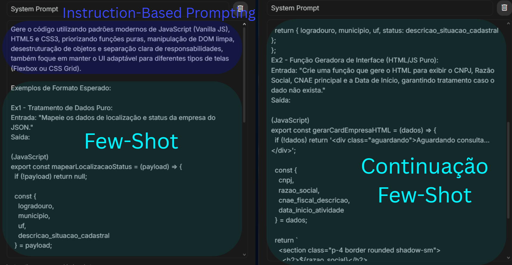
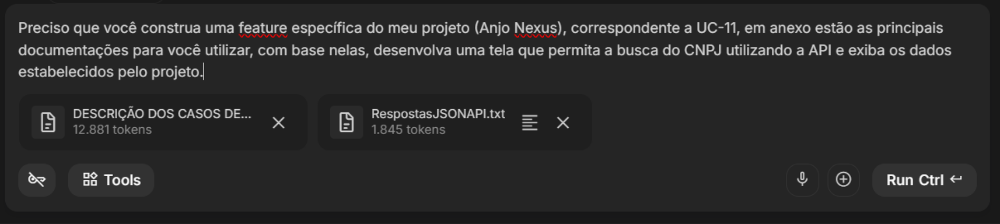
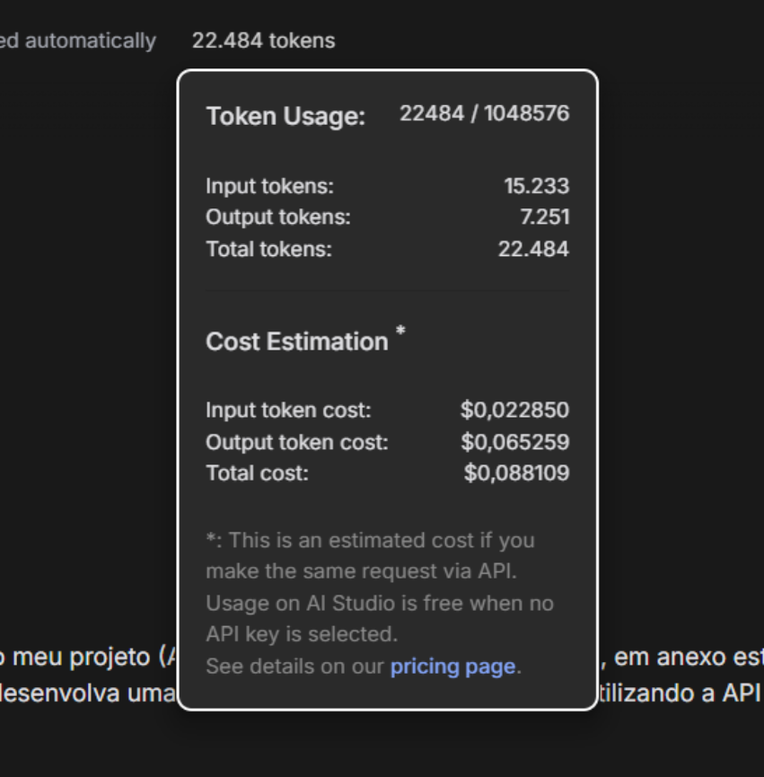
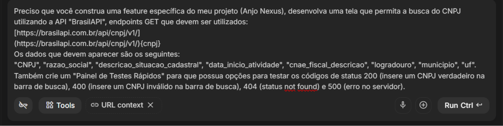
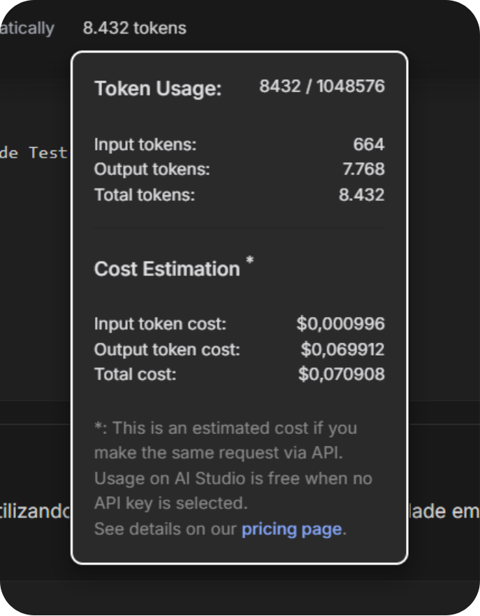

# Anjo Nexus - Engenharia de Prompt e Contexto na Prática

Este repositório contém a documentação e os testes comparativos realizados para o Trabalho Prático 1, demonstrando a aplicação de técnicas de Engenharia de Prompt na estruturação de uma feature de busca de CNPJ.

---

## 1. Contextualização do Projeto (Anjo Nexus)
O **Anjo Nexus** é um sistema projetado para facilitar e otimizar a inscrição de Startups no projeto "Anjo Inovador", um processo seletivo estadual de incentivo. 

As principais funcionalidades da aplicação incluem:
* Visualização organizada de editais.
* Geração automática da Minuta da Startup (documento obrigatório).
* Sistema Kanban para gestão de consultores.
* **Módulo de Consulta (Foco deste trabalho):** Integração com a BrasilAPI para buscar dados estruturados de empresas pelo CNPJ e preencher automaticamente os perfis cadastrais.

---

## 2. System Prompt
O Prompt de Sistema foi configurado para definir as diretrizes arquiteturais, forçando o modelo a utilizar tecnologias nativas e seguir exemplos rigorosos de estruturação de código.

> **Instrução de Sistema Utilizada:**
> "Gere o código utilizando padrões modernos de JavaScript (Vanilla JS), HTML5 e CSS3, priorizando funções puras, manipulação de DOM limpa, desestruturação de objetos e separação clara de responsabilidades, mantendo a UI adaptável para diferentes tipos de telas (Flexbox ou CSS Grid).
> 
> **Exemplos de Formato Esperado:**
> 
> **Ex1 - Tratamento de Dados Puro:**
> Entrada: 'Mapeie os dados de localização e status da empresa do JSON.'
> Saída:
> \`\`\`javascript
> export const mapearLocalizacaoStatus = (payload) => {
>   if (!payload) return null;
>   
>   const { logradouro, municipio, uf, descricao_situacao_cadastral } = payload;
>   return { logradouro, municipio, uf, status: descricao_situacao_cadastral };
> };
> \`\`\`
> 
> **Ex2 - Função Geradora de Interface (HTML/JS Puro):**
> Entrada: 'Crie uma função que gere o HTML para exibir o CNPJ, Razão Social, CNAE principal e a Data de Início, garantindo tratamento caso o dado não exista.'
> Saída:
> \`\`\`javascript
> export const gerarCardEmpresaHTML = (dados) => {
>   if (!dados) return '
Aguardando consulta...
';
> 
>   const { cnpj, razao_social, cnae_fiscal_descricao, data_inicio_atividade } = dados;
> 
>   return \`
>     <section class="p-4 border rounded shadow-sm">
>       <h2>\${razao_social}</h2>
>       <ul class="list-none mt-2">
>         <li><strong>CNPJ:</strong> \${cnpj}</li>
>         <li><strong>Atividade:</strong> \${cnae_fiscal_descricao}</li>
>         <li><strong>Fundação:</strong> \${data_inicio_atividade}</li>
>       </ul>
>     </section>
>   \`;
> };
> \`\`\`

---

## 3. Técnicas Utilizadas

* **Instruction-Based Prompting:** Utilizado para definir restrições técnicas claras (uso exclusivo de HTML/CSS/Vanilla JS) e regras de UI (Mobile-First com Flexbox/Grid). Garante que a IA não utilize frameworks externos, facilitando a publicação e o isolamento do código.
* **Few-Shot Prompting:** Aplicação de exemplos práticos (Ex1 e Ex2) no System Prompt. Justifica-se pela necessidade de eliminar a ambiguidade de formatação, garantindo que a IA entenda o molde exato de como os dados da API devem ser encapsulados e renderizados.

---

## 4. Teste 1: Prompt SEM Curadoria de Contexto

Neste cenário, a IA foi alimentada com o documento completo de Casos de Uso e o payload inteiro da API sem filtragem prévia.

**Prompt do Usuário:**
> "Preciso que você construa uma feature específica do meu projeto (Anjo Nexus), correspondente a UC-11, em anexo estão as principais documentações para você utilizar, com base nelas, desenvolva uma tela que permita a busca do CNPJ utilizando a API e exiba os dados estabelecidos pelo projeto."

**Evidências:**

---

## 5. Teste 2: Prompt COM Curadoria de Contexto

Neste cenário otimizado, removemos os anexos pesados e enviamos apenas as instruções estritamente necessárias e o JSON reduzido.

**Prompt do Usuário:**
> "Preciso que você construa uma feature específica do meu projeto (Anjo Nexus), desenvolva uma tela que permita a busca do CNPJ utilizando a API 'BrasilAPI', endpoints GET que devem ser utilizados: 
> https://brasilapi.com.br/api/cnpj/v1/
> https://brasilapi.com.br/api/cnpj/v1/{cnpj}
> 
> Os dados que devem aparecer são os seguintes: 
> 'CNPJ', 'razao_social', 'descricao_situacao_cadastral', 'data_inicio_atividade', 'cnae_fiscal_descricao', 'logradouro', 'municipio', 'uf'.
> Também crie um 'Painel de Testes Rápidos' para que possua opções para testar os códigos de status 200 (insere um CNPJ verdadeiro na barra de busca), 400 (insere um CNPJ inválido na barra de busca), 404 (status not found) e 500 (erro no servidor)."

**Evidências:**

---

## 6. Análise de Eficiência (Tabela Comparativa)

A tabela abaixo evidencia o ganho de performance e a redução de custos proporcionados pela Engenharia de Prompt (Curadoria).

| Métrica | Cenário 1 (Sem Curadoria) | Cenário 2 (Com Curadoria) | Diferença / Economia |
| :--- | :--- | :--- | :--- |
| **Tokens de Entrada (In)** | 15.233 tokens | 664 tokens | **- 14.569 tokens** (Redução de ~95%) |
| **Custo de Entrada** | $ 0,022850 | $ 0,000996 | Economia de $ 0,021854 |
| **Tokens de Saída (Out)** | 7.251 tokens | 7.768 tokens | + 517 tokens (Código mais estruturado) |
| **Custo de Saída** | $ 0,065259 | $ 0,069912 | --- |
| **CUSTO TOTAL** | **$ 0,088109** | **$ 0,070908** | **Economia real de $ 0,017201 por requisição** |

**Conclusão:** O método sem curadoria consumiu cerca de **22,9 vezes mais tokens de entrada**. A curadoria provou que filtrar o contexto não apenas reduz custos financeiros significativos em escala, mas também melhora a organização da estrutura gerada.

---

## 7. Publicação (Deploy)

A aplicação gerada com o método curado encontra-se publicada e funcional através do GitHub Pages.

🔗 **Acesse as aplicações aqui:**

* [Versão COM Curadoria (Link Principal)](https://robertoyz.github.io/Trabalho-Engenharia-de-Prompt-e-Contexto-na-Pratica/)
* [Versão SEM Curadoria (Link Secundário)](https://robertoyz.github.io/Trabalho-Engenharia-de-Prompt-e-Contexto-na-Pratica/sem-curadoria.html)
---

LINK APRESENTAÇÃO: https://www.canva.com/design/DAHSxJXI-FY/MSaJGBaAbCn93qCnX1eoog/edit

## 8. Equipe Responsável

* Ademar de Araújo Teisen - 23182969-2
* Pedro Emanuel Ferreira de Andrade - 23167567-2
* Roberto Yanez Sanz - 23079491-2S
